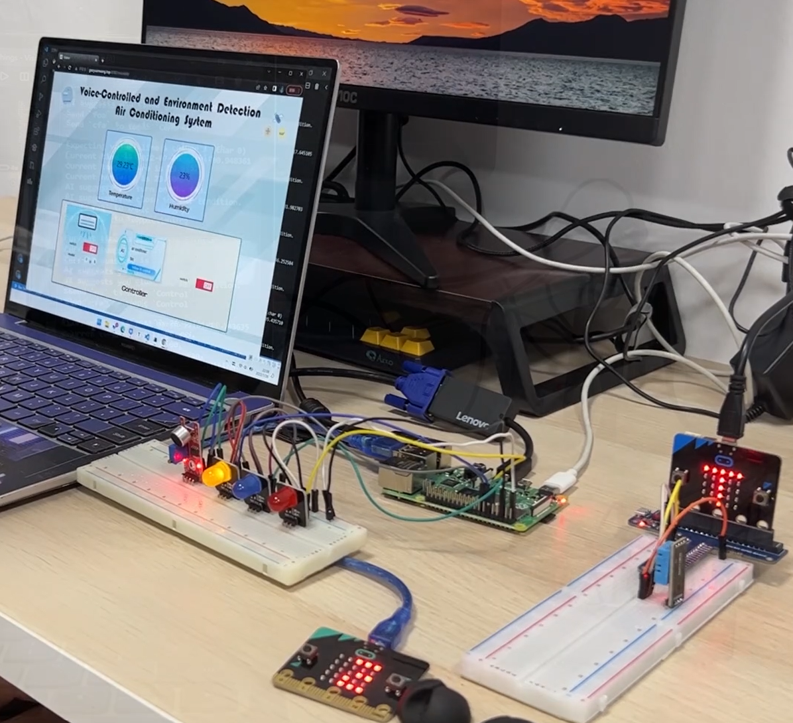

# NUS Summer Workshop2022 — AIoT Finally Porject

**项目名称**：基于环境检测和语音识别的空调系统（其实没有语音识别）

**项目简述**：主要基于microbit和Rasberry Pi，通过温湿度传感器感知环境变化，根据算法调整空调推荐模式并自动提醒用户，或使用户可在其网站线上调节本地空调。详细内容可通过Poster, Video和Presentation了解项目内容。

# 文件结构

- **microbit/**：
  - **transmission.js**：从DHT11温湿度传感器获取数据，并在micro:bit中传递
  - **receive.js**：第二个micro:bit接受数据
- **Raspberry Pi/**：
  - **Pi_from_microbit_pub_mqtt_aly.py**：树莓派从第二个micro:bit有线传输获取数据后，分别利用MQTT向巴法云服务器和阿里云服务器发布数据
  - **Pi_sub_mqtt_control.py**：树莓派从巴法云服务器订阅操作指令，并根据对应topic中的message做出亮灯反应
- **server/**：服务器代码
- **Web/**：网页端代码
- **IntelligentAgriculture/**：微信小程序代码
- **AI/**：
  - **Data/**：存储训练数据集
  - **model/**：存储训练模型
  - **CreateData.py**：造数据
  - **train.py**：利用训练集训练，并生成模型
  - **test.py**：从服务器爬取实时温湿度数据，利用模型生成最优结果
- **SpeechRecognition/**：利用SpeechRecognition包实现语音控制

| LED color |       Function        |
| :-------: | :-------------------: |
|  Yellow   |          Fan          |
|   Blue    | Dehumidification mode |
|    Red    |  Refrigeration mode   |

